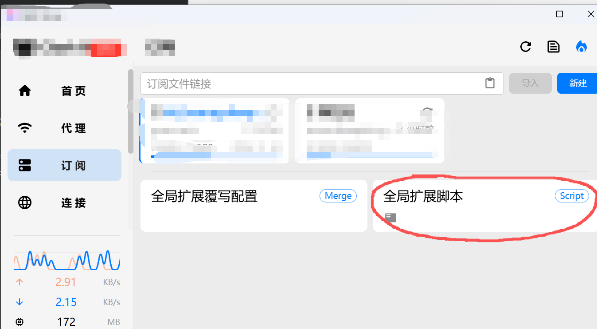

# 🚀 Configure a Proxy Server Using API Proxy CLI

> 本项目记录了使用 [CLIProxyAPI](https://github.com/router-for-me/CLIProxyAPI.git) 配置代理服务器的完整过程。

## 📖 简介

**CLIProxyAPI** 是一款为命令行工具提供兼容 OpenAI / Gemini / Claude / Codex 等主流大模型 API 接口的代理服务器，同时支持 OAuth 登录认证。

---

## ✅ 已实现功能

本项目目前已完成以下客户端的接入配置：

| 类型 | 客户端 | 备注 |
|:---:|:---|:---|
| 🔐 OAuth 登录 | Antigravity | 使用 OAuth 认证 |
| 🔐 OAuth 登录 | Gemini CLI | 使用 Gemini Pro 账号登录 |
| 🤖 AI 工具 | Codex | OpenAI Codex API接入|
| 🤖 AI 工具 | MiniMax | MiniMax API接入 |
| 💻 IDE 插件 | Claude Code | VS Code 插件版本同步支持 |
| 💻 IDE 插件 | Kilo Code | 开源的VS Code AI插件 |
| 🖥️ 桌面应用 | [CC-Switch](https://github.com/farion1231/cc-switch.git) | 用于快速切换Claude Code 配置文件 |
| 🖥️ 桌面应用 | [Cherry Studio](https://github.com/CherryHQ/cherry-studio.git) | AI工作站 |

---

## 🧠 支持的模型

以下模型覆盖日常科研与生产使用需求，按来源分类：

### 🔐 Antigravity OAuth

| 模型名称 | Alias | Fork |
|:---|:---|:---:|
| `rev19-uic3-1p` | gemini-2.5-computer-use-preview-10-2025 | ✅ |
| `gemini-3-pro-image` | gemini-3-pro-image | ✅ |
| `gemini-3-pro-high` | gemini-3-pro-high | ✅ |
| `gemini-3-flash` | gemini-3-flash-preview | ✅ |
| `claude-sonnet-4-5` | claude-sonnet-4-5 | ✅ |
| `claude-sonnet-4-5-thinking` | claude-sonnet-4-5-20250514 | ✅ |
| `claude-opus-4-5-thinking` | claude-opus-4-5-20251101 | ✅ |
| `gemini-2.5-flash` | - | - |
| `gemini-2.5-flash-lite` | - | - |
| `gpt-oss-120b-medium` | - | - |

### 🤖 Codex OAuth

| 模型名称 | Alias |
|:---|:---|
| `gpt-5` | - |
| `gpt-5-codex` | - |
| `gpt-5-codex-mini` | - |
| `gpt-5.1` | - |
| `gpt-5.1-codex` | - |
| `gpt-5.1-codex-max` | - |
| `gpt-5.1-codex-mini` | - |
| `gpt-5.2` | - |
| `gpt-5.2-codex` | - |

### 💎 Gemini CLI OAuth

| 模型名称 | Alias |
|:---|:---|
| `gemini-2.5-pro` | - |
| `gemini-3-pro-preview` | - |
| `gemini-2.5-flash` | - |

> ⚠️ **注意**：目前 Gemini Pro 账号的可用性存在波动，请留意官方状态。

### 🔗 Claude API（第三方）

| 模型名称 | 来源 | Base URL |
|:---|:---|:---|
| `MiniMax-M2.1` | MiniMax | `https://api.minimaxi.com/anthropic` |

---

## 📁 项目结构

本项目分为两个核心部分：

| 目录 | 说明 |
|:---|:---|
| 📂 `server_setting/` | 服务器部署指南 —— 如何搭建代理服务 |
| 📂 `api_setting/` | API 接入指南 —— 如何将 API 接入各类 AI 程序 |

---

## 🎯 快速开始

整个流程非常简单，只需完成 **部署** + **接入** 两个步骤即可：

1. 📖 阅读 `server_setting/` 完成服务器部署
2. 📖 阅读 `api_setting/` 将 API 接入你的 AI 应用
---

## 🔮 代理绕过配置

> ⚠️ **问题场景**：当 CLIProxyAPI 服务器部署在海外时，若本地启用了代理客户端（如 Clash TUN 模式），可能导致发往服务器的 HTTP/HTTPS 请求被代理转发，触发 **502 Bad Gateway** 错误。解决方案是将服务器 IP 加入代理规则的直连白名单。

### 🛠️ 解决方案

在代理客户端（如 Clash）中添加 **全局扩展脚本**，将服务器 IP 设为直连：

```javascript
function main(config) {
  // 在规则最前面插入直连规则
  if (!config.rules) config.rules = [];
  config.rules.unshift("IP-CIDR,your-server-ip/32,DIRECT,no-resolve");
  return config;
}
```

### 📝 配置说明

| 参数 | 说明 |
|:---|:---|
| `your-server-ip` | 替换为你的 CLIProxyAPI 服务器 IP 地址 |
| `/32` | CIDR 掩码，表示精确匹配单个 IP |
| `DIRECT` | 直连，不经过代理 |
| `no-resolve` | 不解析域名，直接使用 IP 匹配 |

> 💡 **提示**：配置完成后，重启代理客户端使规则生效。


## 📚 文档目录

### ⚙️ 服务器配置

| 文件 | 说明 |
|:---|:---|
| [server_setting.md](server_setting/server_setting.md) | 服务器部署完整指南，包含 OAuth 登录、API 接入、模型调用配置 |

### 🔌 API 接入指南

| 文件 | 说明 |
|:---|:---|
| [claude_code.md](api_setting/claude_code.md) | Claude Code 配置指南（环境变量 / CC-Switch / VS Code 插件） |
| [kilo_code.md](api_setting/kilo_code.md) | Kilo Code 插件配置指南 |
| [cherry_studio.md](api_setting/cherry_studio.md) | Cherry Studio 桌面应用配置指南 |
| [ai_studio.md](api_setting/ai_studio.md) | AI Studio 应用配置指南（WebSocket 连接） |

### 📄 配置文件示例

| 文件 | 说明 |
|:---|:---|
| [config.yaml](configs/config.yaml) | CLIProxyAPI 服务端配置文件示例 |
| [settings.json](configs/settings.json) | VS Code Claude Code 插件配置示例 |
