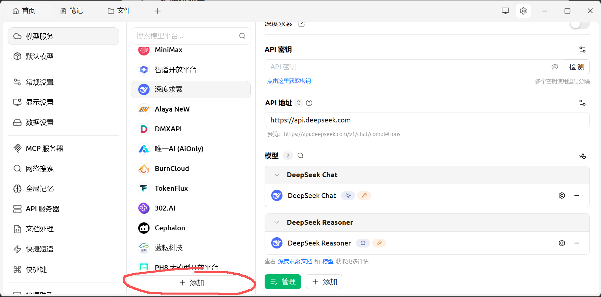
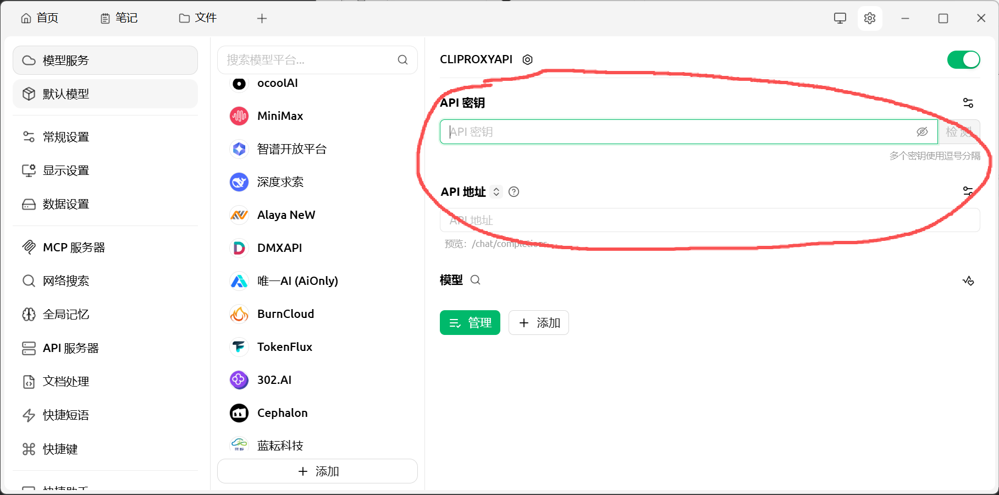
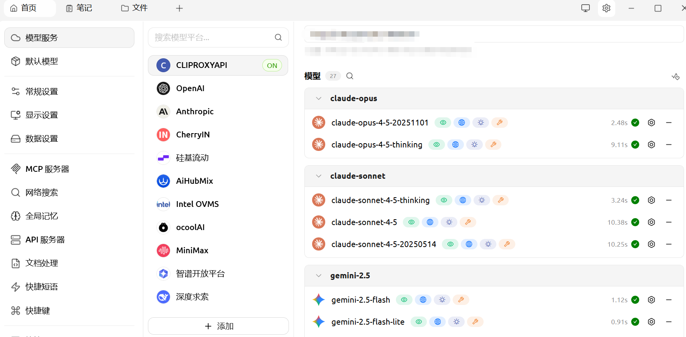

# 🍒 Cherry Studio 配置指南

> 本文档介绍如何将 [Cherry Studio](https://github.com/CherryHQ/cherry-studio.git) 接入我们配置的代理服务器。

---

## 📋 配置步骤

### 步骤 1：添加 API 提供商

1. 下载并打开 **Cherry Studio**
2. 点击右上角的设置图标（⚙️ 齿轮）
3. 点击 **添加** 新的提供商

### 步骤 2：填写提供商信息

填写自定义的提供商名称：

### 步骤 3：配置 API 密钥和 URL

| 配置项 | 值 |
|:---|:---|
| API 密钥 | CLIProxyAPI 的 API 密钥 |
| API URL | `http://yourserverip:8317` |

### 步骤 4：添加可用模型

1. 点击 **管理**
2. 从列表中选择需要添加的模型

### 步骤 5：测试连接

点击 **检测**，确认所有模型都能正常连通：

---

## ✅ 配置完成

恭喜！现在可以在 Cherry Studio 中使用我们代理的所有模型了 🎉

---

## 💡 推荐模型

| 模型 | 说明 | 适用场景 |
|:---|:---|:---|
| `gemini-3-pro-image` | Google 多模态大模型 | 图片生成、图像理解 |

> ✨ **推荐**：`gemini-3-pro-image` 是 Google 的多模态大模型，在图片生成方面表现出色，非常适合创意设计和内容创作！