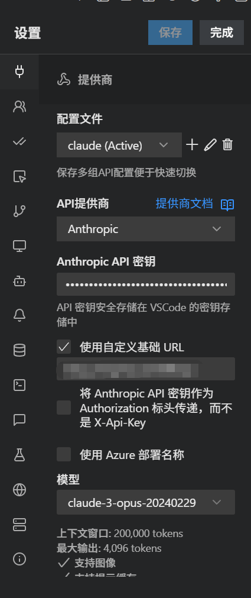

# 🔌 Kilo Code 配置指南

> 本文档介绍如何将 Kilo Code 插件接入我们配置的代理服务器。

---

## 📋 配置步骤

以 **Anthropic** 为例，其他 API 供应商配置方法类似：

1. 安装 **Kilo Code** 插件
2. 点击设置图标（⚙️ 齿轮）
3. 选择 API 供应商 → **Anthropic**
4. 创建一个自定义配置文件（方便管理多个配置）
5. 填写以下配置：

| 配置项 | 值 |
|:---|:---|
| API 密钥 | CLIProxyAPI 的 API 密钥 |
| ☑️ 自定义基础 URL | `http://yourserverip:8317` |

6. 点击 **保存**

---

## ⚠️ 重要：模型名称匹配

在 CLIProxyAPI 配置文件中，模型的 **名称** 或 **别名** 必须与 Kilo Code 中的模型名称一致，否则无法识别。

### 💡 别名机制说明

| 步骤 | 说明 |
|:---|:---|
| 1️⃣ 配置别名 | 在 CLIProxyAPI 中为 `claude-opus-4-5-thinking` 配置别名 `claude-opus-4-5-20251101` |
| 2️⃣ Kilo Code 选择 | 在 Kilo Code 中选择 `claude-opus-4-5-20251101` |
| 3️⃣ 实际调用 | Kilo Code 通过 CLIProxyAPI 接口调用，实际使用的是 `claude-opus-4-5-thinking` 模型 |

> 📖 **原理**：Kilo Code 的模型列表可能没有某些原始模型名称，通过配置别名可以实现模型映射。

---

## ✅ 配置完成

完成以上配置后，即可在 Kilo Code 中使用我们代理的所有模型！